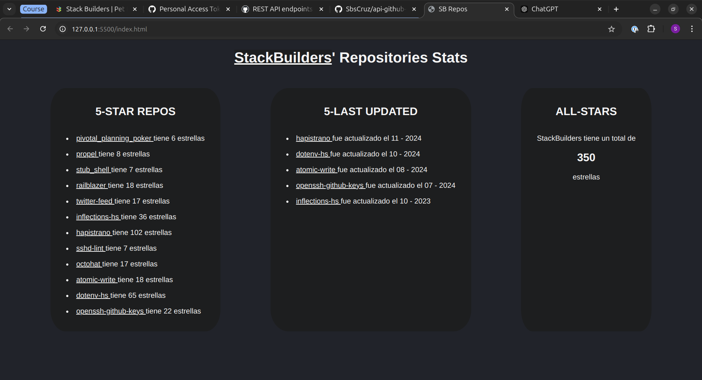
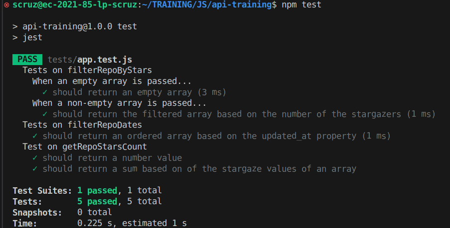

# API-Github-Training!

This is a website that shows some stats of [StackBuilders](https://github.com/stackbuilders)' github.

It was developed using the `github API`

You'll be able to see:
* all the 5-star repos
* last updated repos
* total stars of SB repos



THis project also count with tests made with `Jest`, they can be run by the following command line:
```bash
npm test
```

